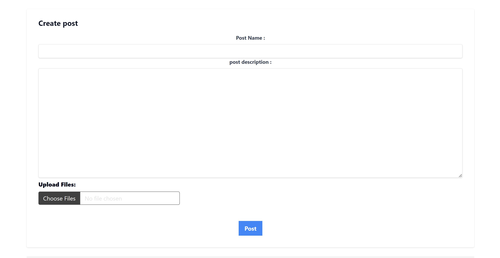
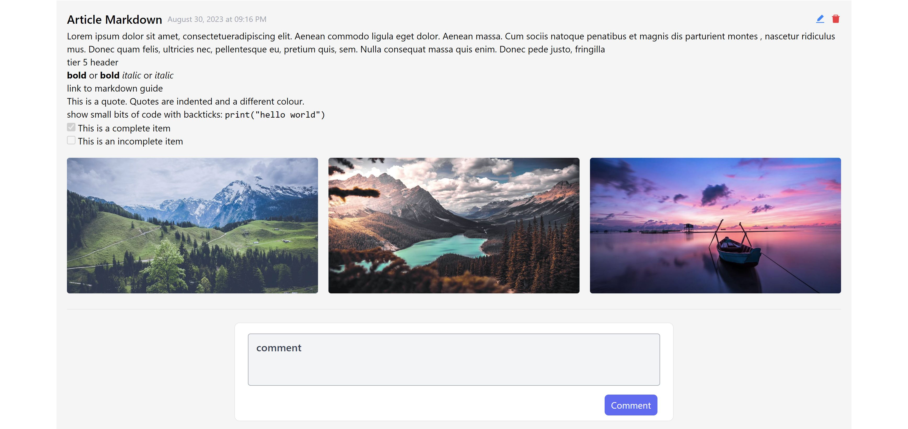
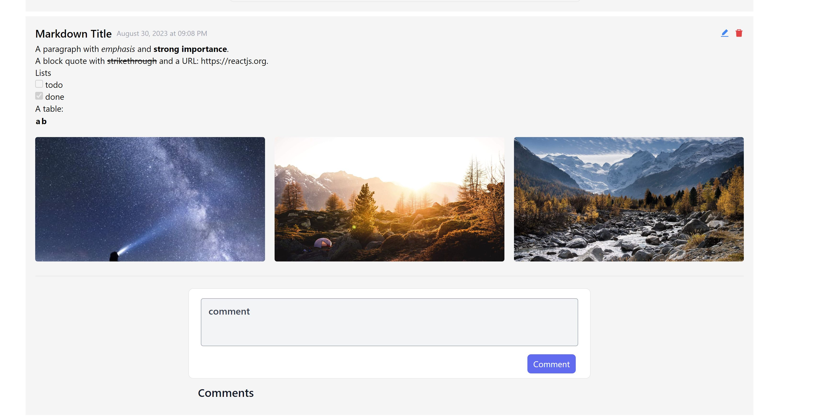
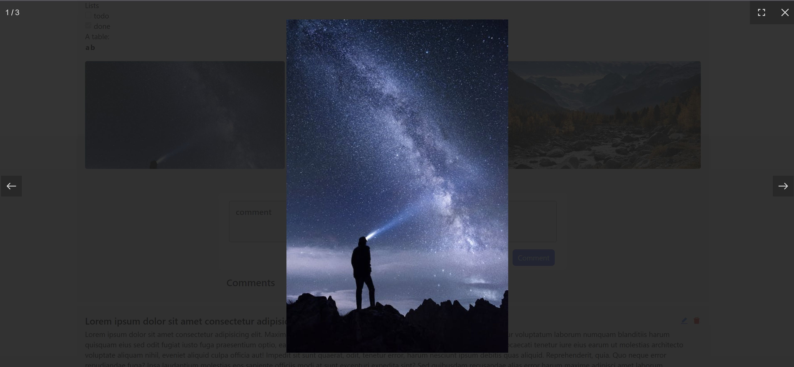
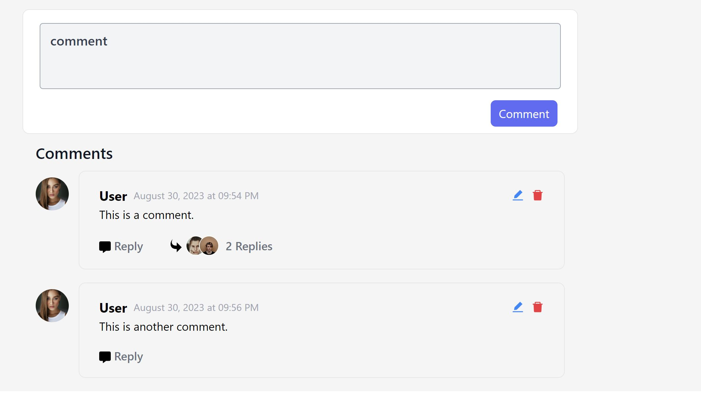
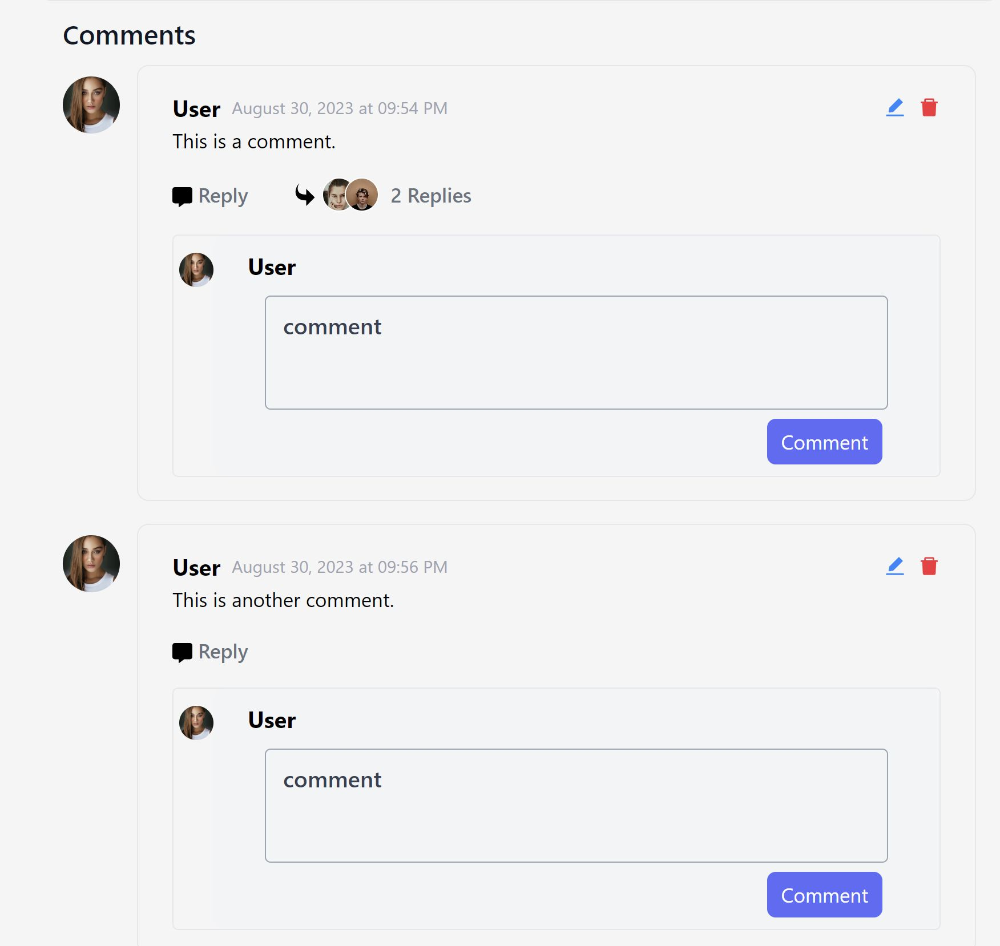
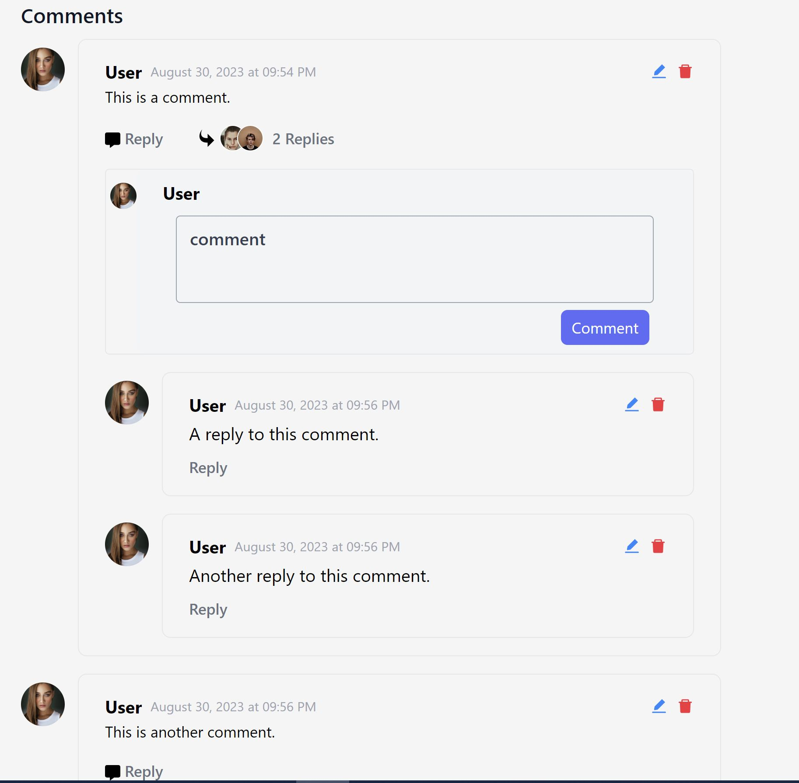
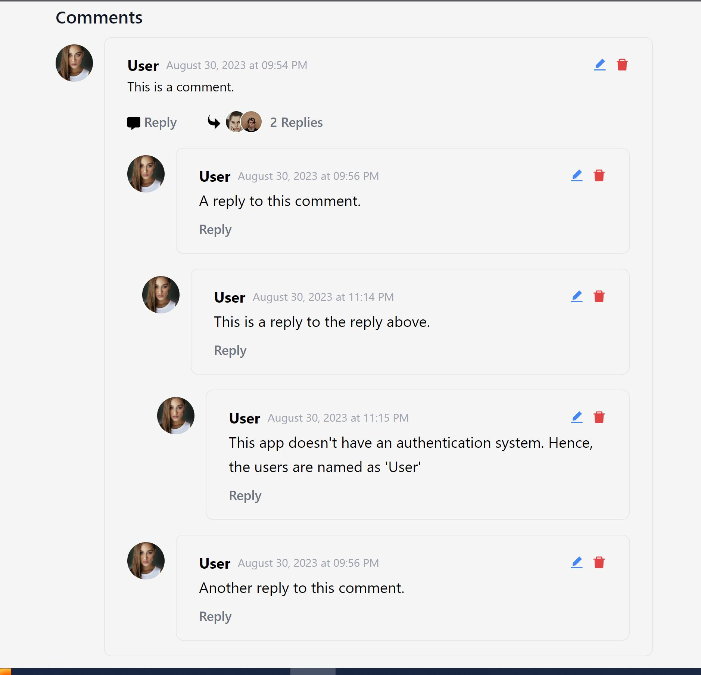

## Blog Post with Nested Commenting System

#### Technology Used:

- React
- ExpressJS
- Typescript
- TailwindCSS
- MongoDB
- Multer (to handle image upload)
- compressorjs (to compress uploaded images)
- fslightbox-react (for displaying images in a lightbox)
- react-markdown
- react-hook-form
- axios

#### Features implemented:

- Blog post
- image/file upload
- form validation
- compressing upload images
- lightbox for images
- comment under post
- Nested commenting / Multi-level commenting / replies to comment

### Post Form:

### Post with normal text and markdown language:

### Post with markdown language:

### Image Lightbox:

### Comments with nested commenting:

